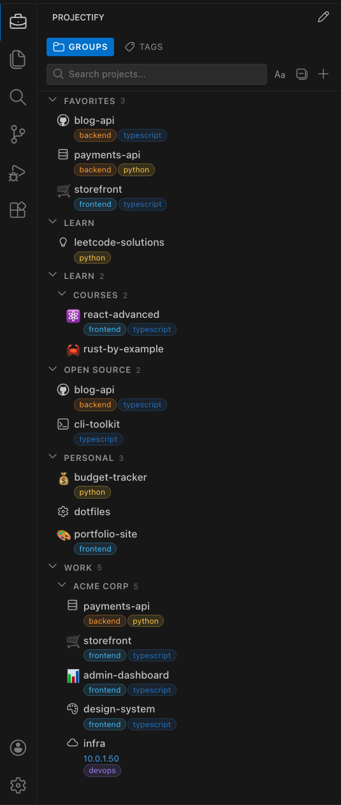
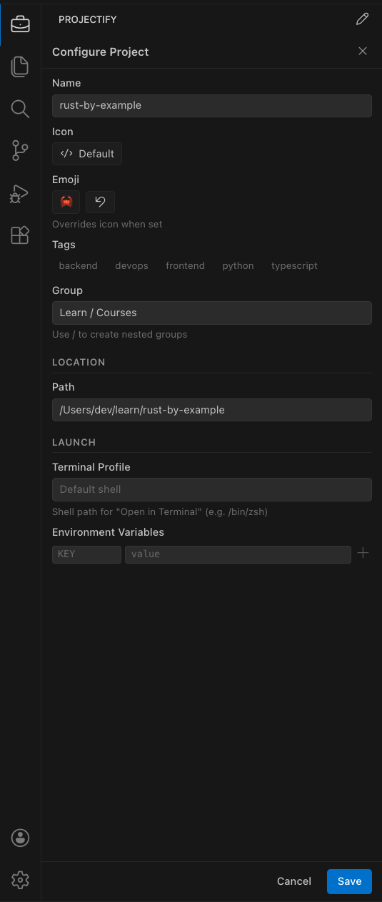

<p align="center">
  <a href="https://devembers.com">
    
  </a>
</p>
<p align="center">
  <strong>Built by <a href="https://devembers.com">DevEmbers</a></strong>
</p>

---

# Projectify

A zero-configuration project manager for VS Code. Organize, group, tag, and switch between your projects from the sidebar.

## Groups

Organize projects into nested groups, pin favorites to the top, and personalize with icons and emoji.



## Tags

Create colored tags, assign them to projects, and filter your list instantly.


## Configure

Customize each project with icons, emoji, tags, groups, terminal profile, and environment variables.



## Features

- **Sidebar panel** — dedicated activity bar icon with a full project list
- **Groups** — organize projects into nested groups (e.g. `Work/Frontend`)
- **Tags** — create colored tags and filter projects by them
- **Favorites** — star projects to pin them to the top
- **Search** — instantly filter projects by name
- **SSH & Remote** — add remote projects and open them via SSH
- **Custom icons & emoji** — personalize each project with codicons or emoji
- **Open in Terminal** — launch a terminal at any project path with custom shell and environment variables
- **Sort by name or recency** — your choice, persisted across sessions

## Install

Search for **Projectify** in the VS Code Extensions marketplace, or:

```
ext install DevEmbers.projectify
```

## Usage

1. Click the Projectify icon in the activity bar (briefcase icon)
2. Click **+** to add a project (local folder or SSH remote)
3. Right-click or use the gear icon to configure groups, tags, icons, and more
4. Click a project to open it — or use `Cmd+Alt+P` to focus the sidebar

## Keyboard Shortcuts

| Action           | macOS       | Windows/Linux |
| ---------------- | ----------- | ------------- |
| Focus Projectify | `Cmd+Alt+P` | `Ctrl+Alt+P`  |

## Settings

| Setting                    | Default         | Description                            |
| -------------------------- | --------------- | -------------------------------------- |
| `projectify.sortBy`        | `recency`       | Sort by `name` or `recency`            |
| `projectify.openBehavior`  | `currentWindow` | `currentWindow`, `newWindow`, or `ask` |
| `projectify.showStatusBar` | `true`          | Show current project in the status bar |
